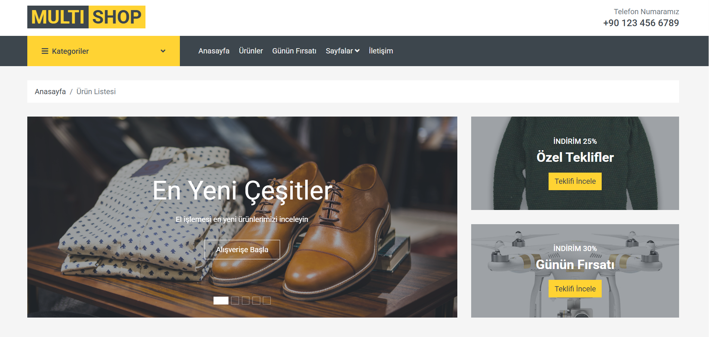
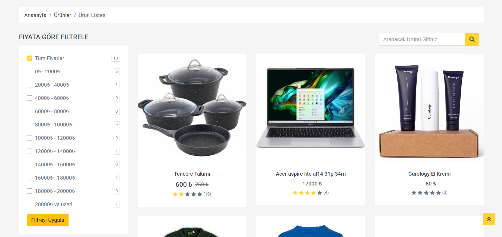
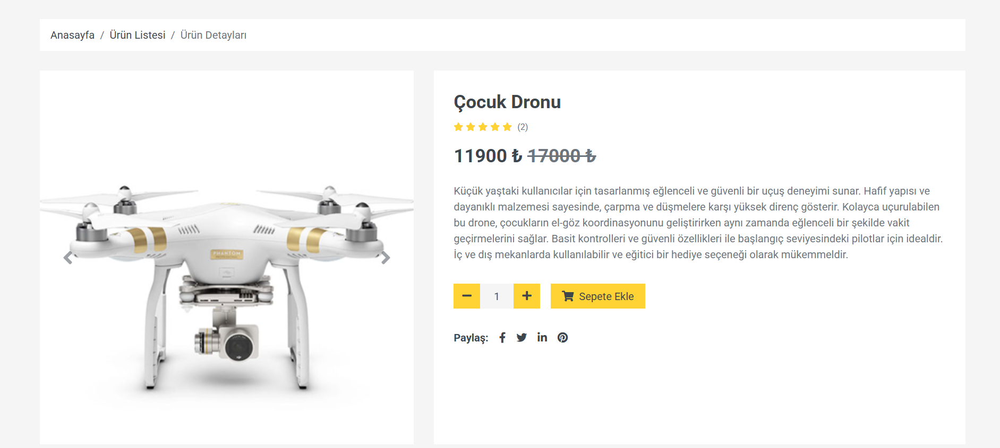
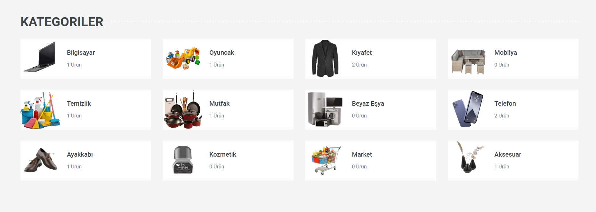
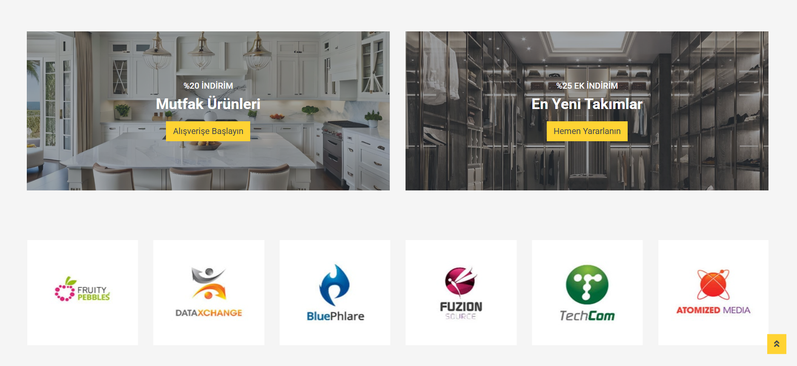
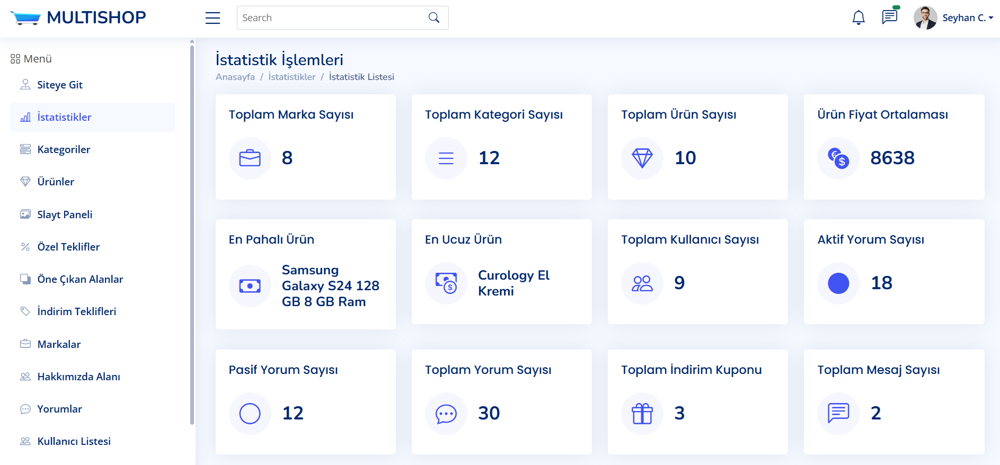

# MULTISHOP E-Commerce Project



## About The Project

MULTISHOP is a comprehensive e-commerce platform where products from various categories are sold. It offers advantageous shopping opportunities with daily and frequent discounts. Category and price filtering features allow users to easily find the products they are looking for.

### Features

- **Product Category Filtering:** Users can filter products by categories
- **Price Filtering:** Product search can be done according to budget
- **Discounted Products:** Daily and periodic discounts
- **User and Admin Panels:** Separate panels for easy management
- **Responsive Design:** Compatible view on mobile, tablet and desktop devices

## Project Areas

### Products Area


In the products area, users can view all products in different categories. They can filter by price range and easily discover discounted products. Each product card displays price, rating score, and discount information.

### Product Detail Area


The product detail page contains all the features, detailed descriptions, and user reviews of the product. Users can examine the large image of the product, add it to the cart, and share it on social media.

### Categories Area


In the categories area, users can view all product categories available on the platform. A special image and the number of products in that category are shown for each category. Users can quickly access related products by clicking on the category.

### Discounts and Brands Area


In the discounts and brands area, current campaigns and partner brands are displayed. Users can take advantage of special discount opportunities and discover brand-specific products. Seasonal campaigns are highlighted here.

### Admin Panel


The admin panel is designed for site administrators to manage the entire platform. Operations such as statistics, user management, product adding/editing are performed through this panel.

## Project Structure

```
MultiShop/
├── ApiGateWay/                # API Gateway service
├── Frontends/
│   ├── MultiShop.WebUI/       # Web user interface
│   └── MultiShop.DtoLayer/    # Data transfer objects
├── IdentityServer/            # Identity authentication service
├── Services/
│   ├── Basket/                # Basket operations microservice
│   ├── Cargo/                 # Cargo operations microservice
│   ├── Catalog/               # Product catalog microservice
│   ├── Comment/               # Comment operations microservice
│   ├── Discount/              # Discount operations microservice
│   ├── Message/               # Messaging microservice
│   ├── Notification/          # Notification microservice
│   ├── Order/                 # Order operations microservice
│   ├── Payment/               # Payment operations microservice
```

## Technologies

- **.NET Core 8.0**
- **Microservice Architecture**
- **Onion Architecture**
- **N-Layer Architecture**
- **CQRS + MediatR**
- **Identity Server**
- **API Gateway**
- **Entity Framework Core**
- **Dapper**
- **SQL Server**
- **MongoDB**
- **PostgreSQL**
- **HTML/CSS/JavaScript**
- **Bootstrap**
- **SignalR**

